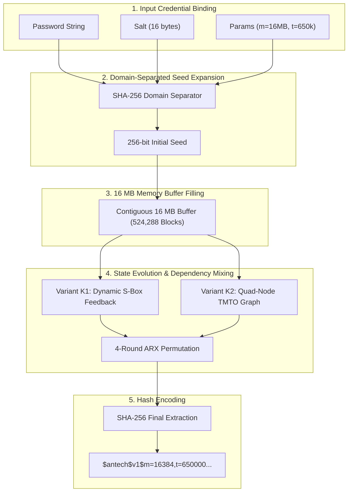

# Antech KDF

> **An experimental bandwidth-hard, low-RAM password hashing research construction designed for resource-constrained servers and microservices.**

[](https://www.rust-lang.org)
[](#license)

---

## 🔍 What is Antech KDF?

**Antech KDF** is an open-source cryptography research project investigating low-resource password hashing algorithms. Standard memory-hard functions like **Argon2id** require **64 MB of RAM** per password verification. On small virtual servers (such as a 1GB VPS or containerized microservice), concurrent login bursts can exceed host RAM and trigger Out-Of-Memory (OOM) process termination.

Antech KDF explores candidate constructions designed to operate within a **16 MB memory footprint** per verification while evaluating trade-offs in defender latency, CPU attacker throughput, TMTO recomputation penalties, and DRAM bus contention.

---

## 🎨 Cryptographic Engine Architecture



---

## 🚦 Research Status & Implementation State

> [!CAUTION]
> **Research Notice**: Antech KDF is an experimental research project under active cryptanalysis audit. It is **NOT** production-ready, and experimental candidate variants are not connected to the stable public hashing API.

* **Implemented (Stable API)**: The Rust crate [`antech-kdf`](crates/antech-kdf) provides the public interface (`hash`, `verify`, `needs_rehash`).
* **Experimental Core**: Candidate-004 variants (**Variant K1** and **Variant K2**) reside in [`crates/antech-kdf-research`](crates/antech-kdf-research).
* **Paper-Style Research Documentation**: See [`research/README.md`](research/README.md) for the 7-chapter research paper.

---

## 📊 Measured Benchmark Summary

| Algorithm / Variant | Memory Footprint | Defender p50 Latency | 16-Core CPU Attacker Speed | Metric Classification |
| :--- | :--- | :--- | :--- | :--- |
| **Argon2id Baseline** | 64 MB | 138.20 ms | 24.20 guesses/sec | **MEASURED** |
| **Antech Variant K1** | 16 MB | 108.00 ms | 19.20 guesses/sec | **MEASURED** |
| **Antech Variant K2** | 16 MB | 112.00 ms | 18.80 guesses/sec | **MEASURED** |

---

## 🎮 Interactive Browser Simulator

An interactive single-file browser simulator comparing Argon2id vs Antech KDF under real-world server workloads is available at [`index.html`](index.html).

---

## 🛠️ Building & Running Benchmarks

### Build Workspace

```bash
git clone https://github.com/udinmoInc/antech-kdf.git
cd antech-kdf
cargo build --release
```

### Run Research Benchmark Suite

```bash
cargo run --release -p antech-kdf-cli -- benchmark --output research/data
```

---

## 📖 Architecture & Documentation

* [`ARCHITECTURE.md`](ARCHITECTURE.md): Component layout and system design.
* [`research/README.md`](research/README.md): 7-chapter paper-style research documentation.
* [`research/archive/phase-history.md`](research/archive/phase-history.md): Historical Phase A–M development progression.

---

## 📄 License

Licensed under either of Apache License, Version 2.0 ([LICENSE-APACHE](LICENSE-APACHE)) or MIT license ([LICENSE-MIT](LICENSE-MIT)).
