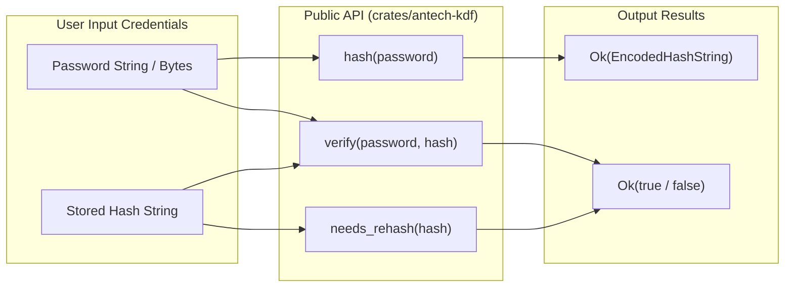

# Antech KDF — Developer API Specification & Integration Guide

The `antech-kdf` Rust crate provides a simple, self-describing password hashing API. Low-level primitives, secure random salt generation, domain separation, parameter parsing, and constant-time string verification are managed automatically.

---

## 🎨 Public API Signature Overview



---

## 🚀 Rust Code Snippets & Usage Examples

### 1. Basic Password Hashing & Verification

```rust
use antech_kdf::{hash, verify, needs_rehash, Error};

fn main() -> Result<(), Error> {
    let password = "correct_horse_battery_staple";

    // 1. Hash a password using recommended default parameters
    let stored_hash = hash(password)?;
    println!("Encoded Hash: {}", stored_hash);
    // Output: $antech$v1$m=16384,t=120,p=1$4242...$a1f9...

    // 2. Verify password against stored hash in constant time
    let is_valid = verify(password, &stored_hash)?;
    assert!(is_valid, "Password verification failed");

    // 3. Reject invalid passwords cleanly
    let is_wrong_valid = verify("wrong_password", &stored_hash)?;
    assert!(!is_wrong_valid, "Invalid password incorrectly accepted");

    // 4. Check if re-hashing is required due to parameter upgrades
    let rehash_needed = needs_rehash(&stored_hash)?;
    assert!(!rehash_needed);

    Ok(())
}
```

---

### 2. Error Handling & Edge Cases

The API returns structured, non-panicking `Result<T, Error>` enums:

```rust
use antech_kdf::{verify, Error};

fn authenticate_user(input_pwd: &str, stored_hash: &str) {
    match verify(input_pwd, stored_hash) {
        Ok(true) => println!("AUTHENTICATED: Access granted."),
        Ok(false) => println!("DENIED: Password incorrect."),
        Err(Error::InvalidHash) => eprintln!("SECURITY ALERT: Stored hash format is malformed."),
        Err(Error::UnsupportedVersion) => eprintln!("UPGRADE REQUIRED: Hash version not supported."),
        Err(e) => eprintln!("ERROR: Authentication failure: {}", e),
    }
}
```

---

### 3. C ABI / FFI Foreign Function Interface Bindings

For integration into C, C++, Python, or Go, `antech-kdf-ffi` exposes C-compatible foreign function bindings:

```c
#include <stdio.h>
#include <stdbool.h>
#include "antech_kdf.h"

int main() {
    const char* password = "user_secret_password";
    char hash_buffer[256];

    // Hash password via C ABI
    int status = antech_hash(password, hash_buffer, sizeof(hash_buffer));
    if (status == 0) {
        printf("C ABI Hashed: %s\n", hash_buffer);

        // Verify password via C ABI
        bool is_valid = false;
        if (antech_verify(password, hash_buffer, &is_valid) == 0 && is_valid) {
            printf("C ABI Verified: Success!\n");
        }
    }
    return 0;
}
```
