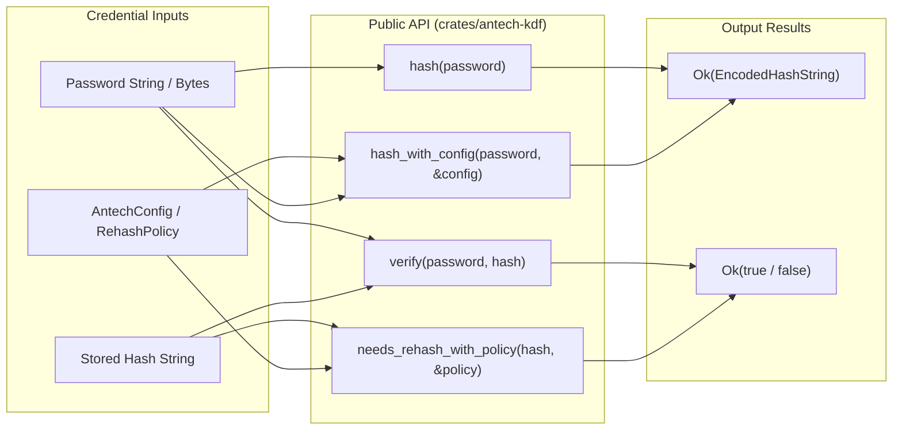

# Antech KDF — Developer API Specification & Integration Guide

The `antech-kdf` Rust crate provides a simple, self-describing password hashing API alongside advanced configurable builder APIs for custom deployment environments.

---

## 🎨 Public API Overview



---

## 🚀 Usage Examples

### 1. Default Password Hashing & Verification

```rust
use antech_kdf::{hash, verify, needs_rehash, Error};

fn main() -> Result<(), Error> {
    let password = "correct_horse_battery_staple";

    // Hash using default parameters (16 MB RAM, 16-byte salt)
    let stored_hash = hash(password)?;
    println!("Hash: {}", stored_hash);

    // Verify password against stored hash in constant time
    let is_valid = verify(password, &stored_hash)?;
    assert!(is_valid);

    // Check if rehash is required
    let rehash_needed = needs_rehash(&stored_hash)?;
    assert!(!rehash_needed);

    Ok(())
}
```

---

### 2. Advanced Parameter Configuration (`AntechConfig`)

Developers can configure algorithm parameters cleanly using `AntechConfig::builder()`:

```rust
use antech_kdf::{hash_with_config, verify, Algorithm, AntechConfig, Error};

fn main() -> Result<(), Error> {
    let password = "custom_deployment_password";

    // Build custom configuration
    let config = AntechConfig::builder()
        .algorithm(Algorithm::Antech)
        .salt_length(32)           // 8 to 256 bytes validated
        .memory_mib(24)            // 16 to 256 MiB supported
        .passes(3)                 // Execution passes
        .dependency_depth(700_000) // Sequential steps
        .output_length(32)         // 8 to 128 bytes digest
        .build()?;

    // Hash with custom config
    let encoded_hash = hash_with_config(password, &config)?;
    println!("Custom Hash: {}", encoded_hash);

    // Verify using standard verify API (recovers parameters automatically from stored string)
    let is_valid = verify(password, &encoded_hash)?;
    assert!(is_valid);

    Ok(())
}
```

---

### 3. Application Rehash Policies (`RehashPolicy`)

```rust
use antech_kdf::{hash, needs_rehash_with_policy, RehashPolicy};

fn main() -> Result<(), Box<dyn std::error::Error>> {
    let stored_hash = hash("user_password")?;

    // Create application policy enforcing higher memory standards
    let policy = RehashPolicy::builder()
        .minimum_memory_mib(16)
        .preferred_memory_mib(32)
        .preferred_passes(3)
        .build();

    // Check if stored hash needs re-hashing against application policy
    if needs_rehash_with_policy(&stored_hash, &policy)? {
        println!("Hash is outdated; re-hashing required upon login.");
    }

    Ok(())
}
```
