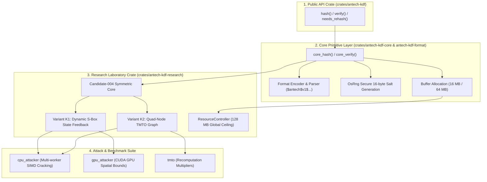
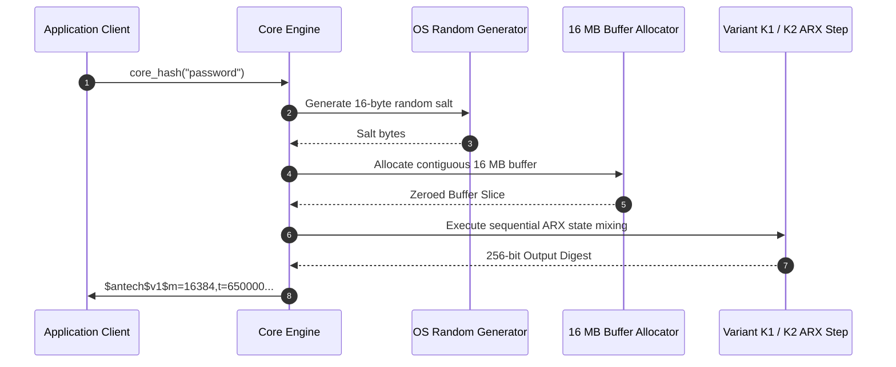

# Antech KDF — System Architecture & Layering

This document describes the modular architecture of **Antech KDF**, detailing how public API calls flow through core cryptographic primitives, research candidate engines, and memory management controllers.

---

## 🏗️ Layered System Architecture

---

## 📦 Workspace Crate Taxonomy

| Crate Path | Primary Purpose | Exported Symbols |
| :--- | :--- | :--- |
| [`crates/antech-kdf`](file:///f:/Coding/experiments/antech-kdf/crates/antech-kdf) | Stable Developer API | `hash()`, `verify()`, `needs_rehash()`, `Error` |
| [`crates/antech-kdf-core`](file:///f:/Coding/experiments/antech-kdf/crates/antech-kdf-core) | Core Engines & Memory Allocation | `core_hash()`, `core_verify()`, `CoreError` |
| [`crates/antech-kdf-format`](file:///f:/Coding/experiments/antech-kdf/crates/antech-kdf-format) | Serialization & Encoding | `encode_hash()`, `parse_hash()`, `HashFormat` |
| [`crates/antech-kdf-types`](file:///f:/Coding/experiments/antech-kdf/crates/antech-kdf-types) | Parameter & Error Structures | `KdfParams`, `AlgorithmVersion` |
| [`crates/antech-kdf-research`](file:///f:/Coding/experiments/antech-kdf/crates/antech-kdf-research) | Laboratory Candidates & Benchmarks | `Candidate004`, `VariantK1`, `VariantK2`, `run_research_suite()` |

---

## ⚙️ Memory Pipeline Architecture

