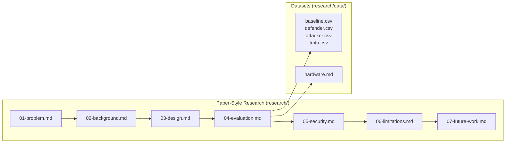

# Antech KDF — Research Documentation Navigation Guide

This document links the core documentation to the 7-chapter paper-style research documentation and research dataset files.

---

## 🗺️ Research Paper Navigation Map

---

## 📖 Chapter Directory

* [**Chapter 1: The Problem**](file:///f:/Coding/experiments/antech-kdf/research/01-problem.md) — Server RAM cost, VPS bounds, 16 MB hypothesis.
* [**Chapter 2: Background**](file:///f:/Coding/experiments/antech-kdf/research/02-background.md) — Argon2id baseline, scrypt, bcrypt, PBKDF2.
* [**Chapter 3: Design**](file:///f:/Coding/experiments/antech-kdf/research/03-design.md) — Candidate-004 core, Variant K1 & K2 design.
* [**Chapter 4: Evaluation**](file:///f:/Coding/experiments/antech-kdf/research/04-evaluation.md) — Measured comparative results (16 MB vs 64 MB).
* [**Chapter 5: Security**](file:///f:/Coding/experiments/antech-kdf/research/05-security.md) — Adversarial cost modeling, TMTO, multi-target.
* [**Chapter 6: Limitations**](file:///f:/Coding/experiments/antech-kdf/research/06-limitations.md) — Pending CUDA GPU measurements, ASIC bounds.
* [**Chapter 7: Future Work**](file:///f:/Coding/experiments/antech-kdf/research/07-future-work.md) — Physical CUDA execution roadmap, audit plans.
