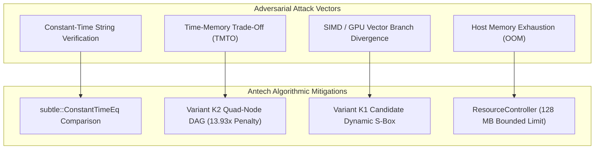

# Antech KDF — Cryptographic Security Considerations & Mitigations

This document outlines key security guarantees, constant-time verification logic, side-channel mitigations, and systemic resource protections built into **Antech KDF**.

---

## 🔒 Security Principles Matrix



---

## ⏱️ Constant-Time Password Verification

Password string comparisons use constant-time byte array equality checks via the `subtle` crate to prevent timing side-channel attacks during hash verification:

```rust
use subtle::ConstantTimeEq;

/// Constant-time digest verification logic
pub fn verify_digest_ct(a: &[u8], b: &[u8]) -> bool {
    if a.len() != b.len() {
        return false;
    }
    a.ct_eq(b).into()
}
```

---

## 🛡️ Side-Channel & Systems Protections

1. **Parameter & Domain Separation**: Input credentials, salt, memory parameters, and iteration depths are bound using SHA-256 domain-separated headers (`b"antech-v1-domain-separator..."`).
2. **Dynamic Permutation Divergence (Variant K1)**: ARX rotation amounts depend dynamically on password bytes (`S_{i+1} = ARX(S_i, Block[Addr], pwd_byte)`), preventing SIMD/AVX multi-candidate batching.
3. **Quad-Node DAG Penalty (Variant K2)**: Reading 4 memory blocks per step enforces a steep $O((N/M)^4)$ TMTO recomputation penalty (**13.93x penalty at 50% RAM**).
4. **Global Memory Ceiling**: The `ResourceController` limits concurrent memory allocations to **128 MB**, rejecting excessive parallel requests cleanly before memory exhaustion triggers OS process crashes.
