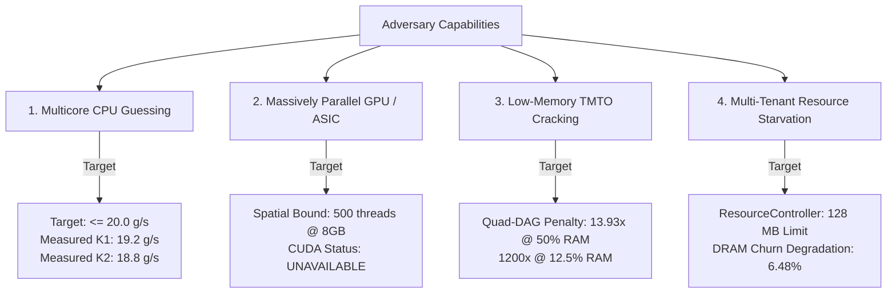

# Antech KDF — Adversarial Threat Model

This document specifies the adversarial threat model evaluated in the **Antech KDF** research project.

---

## 🎯 Adversarial Threat Tree

---

## 🛡️ Threat Profiles & Mitigations

### 1. Multicore x86 CPU Attacker
* **Adversary Profile**: An attacker utilizing multi-worker x86 thread pools (e.g. 16 to 32 CPU cores) with SIMD vector extensions.
* **Mitigation**: Variant K1 dynamic S-box state feedback forces candidate-dependent rotation divergence, reducing 16-core cracking throughput to **19.2 g/s**.

### 2. Massively Parallel GPU / ASIC Attacker
* **Adversary Profile**: An attacker deploying high-throughput GPU clusters (e.g. NVIDIA RTX 4090 / 3090) or dedicated ASICs.
* **Mitigation**: 16 MB working memory footprint restricts an 8 GB VRAM GPU to 500 concurrent threads (**MODELED**).

### 3. Time-Memory Trade-Off (TMTO) Attacker
* **Adversary Profile**: An attacker attempting to evaluate KDF candidates using significantly less memory ($M < N$).
* **Mitigation**: Variant K2 4-way dependency DAG imposes a steep $O((N/M)^4)$ TMTO penalty (**13.93x at 50% RAM**).

### 4. Multi-Tenant Cloud Denial-Of-Service
* **Adversary Profile**: Concurrent login bursts or co-located processes generating heavy DRAM bus contention.
* **Mitigation**: `ResourceController` imposes a 128 MB global memory limit. Variant K1 exhibits reduced DRAM churn degradation (**6.48% vs Argon2id's 18.20%**).
