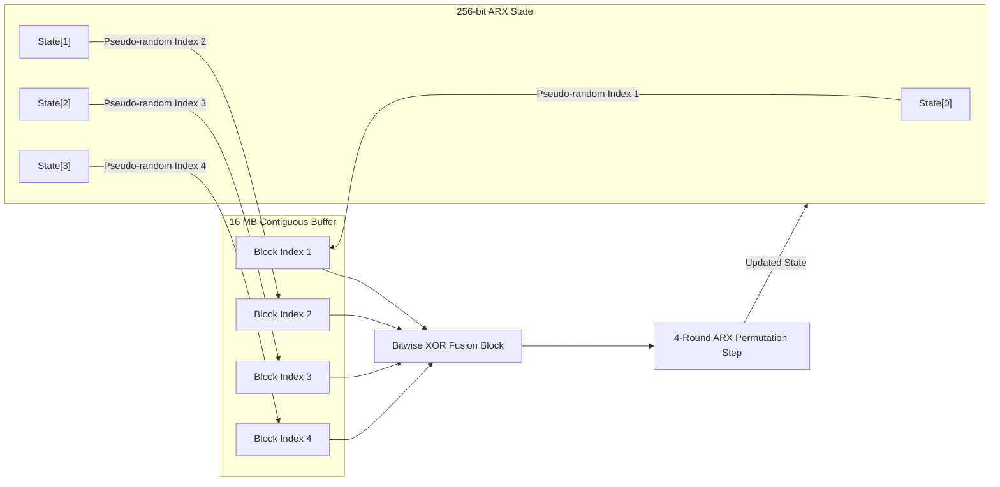

# Chapter 3: Antech Construction & Design Principles

The primary design goal of Antech is to achieve robust offline attacker cost within a reduced **16 MB memory footprint**, as motivated in [Chapter 1: The Problem](01-problem.md). Rather than relying solely on memory size to slow down adversaries, the design incorporates tight sequential dependency chains and candidate-dependent state evolution.

### Core Candidate-004 Architecture
The derivation process begins with strict parameter binding. The input password, salt, target memory size, dependency depth, and pass count are bound together using SHA-256 to generate a 256-bit seed. This seed initializes a contiguous **16 MB memory buffer** (`524,288` 32-byte blocks) via sequential SHA-256 expansion, ensuring that the entire buffer depends deterministically on the input credentials.

Following buffer initialization, an internal 256-bit register state undergoes iterative mixing across a long sequential dependency chain. In each step, state variables compute pseudo-random block addresses within the buffer, extract memory blocks, apply bitwise XOR operations, and update the state using a 4-round Add-Rotate-Xor (ARX) permutation function.

### Variant K2 Quad-DAG Dependency Topology

### Research Variants
To explore trade-offs between SIMD vectorization resistance and time-memory trade-off (TMTO) bounds, we constructed two active research variants:

* **Variant K1 (Attacker Parallelism Reduction)**:
  Variant K1 introduces candidate-dependent state feedback into the ARX mixing step. In each iteration, the current step's memory address lookup and ARX rotation values depend directly on password bytes (`S_{i+1} = ARX(S_i, Block[Addr], pwd_byte)`). Because every candidate password drives a unique state evolution sequence, SIMD/AVX multi-candidate vectorization and GPU SIMT warp execution experience severe execution divergence.
  
* **Variant K2 (Quad-Node TMTO Graph)**:
  Variant K2 modifies the dependency structure into a 4-way directed acyclic memory graph. Each iteration reads 4 pseudo-random blocks simultaneously from distinct buffer locations (`Block1 ^ Block2 ^ Block3 ^ Block4`). This quad-node dependency structure enforces a steep $O((N/M)^4)$ TMTO recomputation penalty if an adversary attempts to evaluate the algorithm using reduced memory ($M < N$).

Upon completing the sequential dependency passes, a final SHA-256 extraction step compresses the 256-bit register state into the output digest, formatted as a self-describing `$antech$v1$...` hash string.

For empirical benchmark evaluation comparing these variants against Argon2id, see [Chapter 4: Evaluation](04-evaluation.md). For detailed security analysis, see [Chapter 5: Security](05-security.md).
