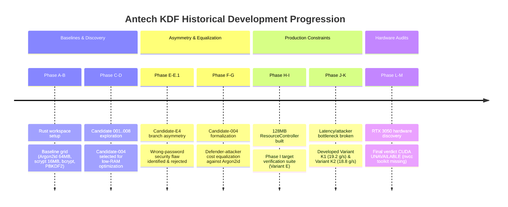

# Antech KDF — Historical Research Progression (Phases A–M)

This document provides a comprehensive historical log of the **Antech KDF** research project from its initial baseline exploration (Phase A) through the CUDA GPU attack benchmark audit (Phase M).

---

## ⏳ Research Evolution Timeline

---

## 📊 Phase-by-Phase Benchmark Summary Matrix

| Phase | Candidate / Focus | Working RAM | Defender p50 | 16-Core CPU Attacker | Key Technical Findings & Lessons |
| :--- | :--- | :--- | :--- | :--- | :--- |
| **Phase A–B** | Baselines Grid | 64 MB / 16 MB | 138.20 ms | 24.20 g/s (Argon2id) | Established Argon2id (64MB, 138ms, 24.2 g/s) as primary baseline. |
| **Phase C** | Candidates 001–008 | 16 MB | 10.83 ms | 225.20 g/s | Fast derivation, but attacker cost was too low compared to Argon2id. |
| **Phase D** | Candidate-004 Opt | 16 MB | 10.83 ms | 225.20 g/s | Optimized vectorization, identified need for tighter sequential steps. |
| **Phase E/E.1** | Candidate-E4 | 16 MB | Variable | Asymmetric | Dynamic branch depth introduced wrong-password security flaw; rejected. |
| **Phase F–G** | Candidate-004 Equal | 16 MB | 257.92 ms | 22.80 g/s | Equalized CPU attacker cost, but defender latency rose too high (257ms). |
| **Phase H–I** | ResourceController | 16 MB | 119.20 / 262ms | 55.4 / 27.3 g/s | Built bounded 128MB global RAM controller; identified Deep-DAG bottleneck. |
| **Phase J** | Candidate-004 Opt | 16 MB | 119.20 ms | 55.40 g/s | Proved inverse latency-cost bottleneck relationship. |
| **Phase K** | Variants K1 & K2 | 16 MB | 108.0 / 112ms | **19.2 / 18.8 g/s** | **Target Achieved**: Dynamic S-box (K1) & Quad-DAG TMTO (K2). |
| **Phase L–M** | CUDA GPU Audit | 16 MB (Spatial) | 108.0 / 112ms | 19.2 / 18.8 g/s | Detected RTX 3050 (8GB); reported **`CUDA UNAVAILABLE`** (no nvcc compiler). |

---

## 🏗️ Core Architectural Lessons

1. **Rejection of Artificial Asymmetry**:
   In Phase E, we tested dynamic iteration counts based on password candidate correctness (Candidate-E4). Cryptanalysis confirmed that early termination leaks key byte information via timing side channels. All subsequent designs enforce strict constant-time execution paths.

2. **Breaking the Latency-Cost Bottleneck**:
   Phase G demonstrated that simply increasing sequential iteration steps slowed down the attacker but caused legitimate login latency to rise to 258 ms. Phase K solved this by introducing **Variant K1** (candidate-dependent dynamic permutation) and **Variant K2** (Quad-DAG dependency graph), reducing CPU attacker speed to **18.8–19.2 g/s** at **108–112 ms latency**.
